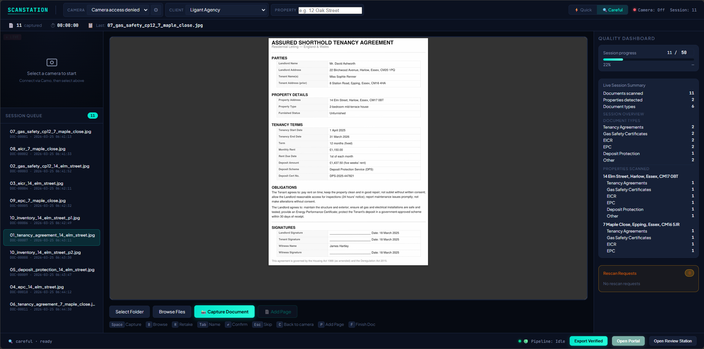
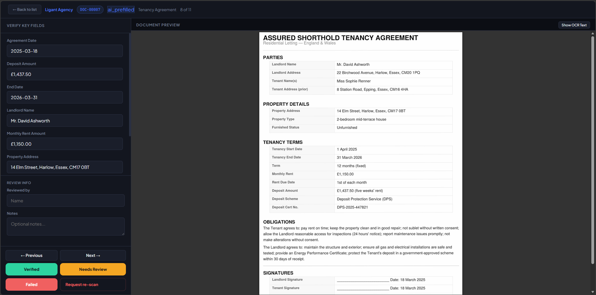
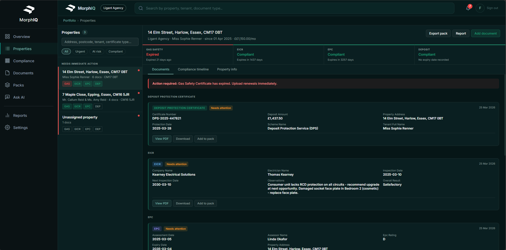
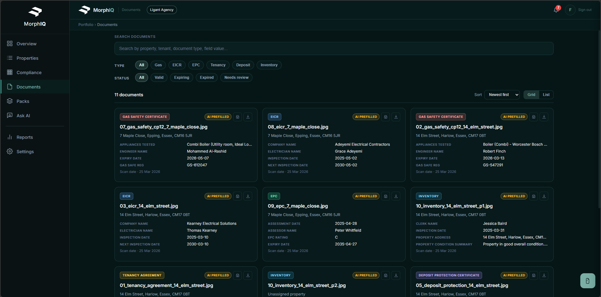

# Morph IQ

**The operating system for property document compliance.**

Morph IQ is a local-first document scanning and compliance platform built for UK letting agencies. It takes physical documents — gas safety certificates, EICRs, EPCs, tenancy agreements, deposit protection certificates — scans them, runs OCR, classifies them with AI, extracts structured fields, and presents everything through a client portal with real-time compliance tracking. Every document is human-verified before delivery, with full chain-of-custody from scan to signed-off archive.

---

## Architecture

```
┌─────────────────────────────────────────────────────────────────────┐
│                         SCAN STATION                                │
│   Camera / File import → Session queue → Multi-page grouping        │
│   scan_station.html  ·  served via server.py (port 8765)            │
└──────────────────────────────┬──────────────────────────────────────┘
                               │  JPEG → raw/
                               ▼
┌─────────────────────────────────────────────────────────────────────┐
│                       OCR / AI PIPELINE                             │
│   auto_ocr_watch.py polls Clients/*/raw/ every 2s                   │
│                                                                     │
│   ImageMagick (pre-process) → OCRmyPDF + Tesseract (searchable PDF) │
│            → ai_prefill.py (Claude API)                             │
│                                                                     │
│   Claude classifies document type, extracts structured fields,      │
│   scores completeness (0–100%), flags missing required fields        │
│   Output: review.json + searchable PDF in Batches/date/DOC-XXXXX/   │
└──────────────────────────────┬──────────────────────────────────────┘
                               │  sync_single_doc()
                               ▼
┌─────────────────────────────────────────────────────────────────────┐
│                       REVIEW STATION                                │
│   review_station.html  ·  Human verification layer                  │
│                                                                     │
│   Reviewer sees: extracted fields + PDF side-by-side                │
│   Actions: verify / flag / rescan / merge / split                   │
│   Gate: cannot mark Verified if property_address is empty           │
│   On save → POST /review → sync_to_portal.py → portal.db           │
└──────────────────────────────┬──────────────────────────────────────┘
                               │  SQLite (portal.db)
                               ▼
┌─────────────────────────────────────────────────────────────────────┐
│                        CLIENT PORTAL                                │
│   portal_new/app.py  ·  Flask  ·  port 5000                        │
│                                                                     │
│   Overview · Properties · Compliance · Documents                    │
│   Packs · Ask AI · Reports · Settings                               │
│                                                                     │
│   Compliance engine tracks Gas Safety / EICR / EPC / Deposit       │
│   Expiry alerts at 30 / 60 / 90 days  ·  Pack builder + ZIP export │
└─────────────────────────────────────────────────────────────────────┘
```

---

## Tech Stack

| Layer | Technology |
|-------|-----------|
| OCR pipeline | Tesseract, OCRmyPDF, ImageMagick |
| AI classification & extraction | Claude API (Anthropic) — `claude-opus-4-6` |
| Backend / API | Python 3, Flask, Flask-Login |
| Database | SQLite (`portal.db`) |
| Document processing | pypdf, ReportLab, pdfminer |
| Frontend | Vanilla JS, PDF.js (no framework) |
| Packaging | zipfile (pack export), openpyxl (Excel) |
| Development tooling | Cursor IDE, Claude Code, Claude.ai |

> Built solo by a non-engineer founder using AI-assisted development. Every architectural decision, schema design, and debugging session was a collaboration between the founder and Claude.

---

## Key Features

**AI Document Pipeline**
- 6 document types: Gas Safety Certificate, EICR, EPC, Tenancy Agreement, Deposit Protection Certificate, Inventory
- Per-type Claude prompts for field extraction with completeness scoring (0–100%)
- `needs_attention` flag raised when required fields are missing or completeness < 70%
- Batch re-processing via `scripts/rerun_prefill.py`

**Human-in-the-Loop Verification**
- ReviewStation shows extracted fields alongside the scanned PDF
- Amber triage indicators for documents that need attention
- Verification gate: `property_address` required before marking Verified
- Merge and split for multi-page documents

**Compliance Engine**
- Tracks 4 certificate types per property: Gas Safety, EICR, EPC, Deposit Protection
- Expiry status: `valid` / `expiring` (≤30 days) / `expired` / `missing`
- Fine exposure calculator (Gas Safety: £6,000 · EICR: £30,000)
- Property-level urgency grouping: Needs immediate action / At risk / Compliant

**Client Portal (8 pages)**
- **Overview**: Compliance score ring, certificate coverage bars, expiry timeline (30/60/90 days)
- **Properties**: Split-panel with cert pills, compliance strip, document cards, timeline tab
- **Compliance**: Risk banner, property × cert-type matrix
- **Documents**: Search, filter, sort — server-side with debounced frontend
- **Packs**: Pack builder with drag-reorder, ZIP + PDF bundle export
- **Ask AI**: Chat interface with document context
- **Reports**: Report templates, audit trail
- **Settings**: Team management, notifications, permissions

**Multi-page Document Support**
- ScanStation groups pages via `Add Page` / `P` shortcut
- ReviewStation merge (combine 2+ docs) and split (separate pages into individual records)

---

## Screenshots

**1 — Capture** · ScanStation with live session intelligence. Browse files or use a phone camera via Camo. AI classifies document type and extracts fields automatically after each scan.



---

**2 — Verify** · ReviewStation shows AI-extracted fields alongside the scanned PDF. Every required field is pre-filled; the reviewer confirms or corrects before marking Verified.



---

**3 — Compliance** · Portal Properties page. Compliance strip shows live cert status per property. Red = expired, amber = expiring, teal = compliant. Document cards show structured extracted fields.



---

**4 — Documents** · Document grid with type tags, AI PREFILLED trust badges, and extracted key fields inline. Filter by type (Gas, EICR, EPC, Tenancy, Deposit, Inventory) or status.



---

## Setup

See **[docs/SETUP_GUIDE.md](docs/SETUP_GUIDE.md)** for full instructions.

**Prerequisites**

```
Python 3.11+
Tesseract OCR        (tesseract --version)
OCRmyPDF             (pip install ocrmypdf)
ImageMagick          (magick --version)
Anthropic API key    (set in .env — see .env.example)
```

**Quick start (Windows)**

```bat
REM 1. Clone and install dependencies
pip install -r requirements.txt

REM 2. Add your Anthropic API key
copy .env.example .env
REM  Edit .env and add your ANTHROPIC_API_KEY

REM 3. Start everything
Start_System_v2.bat

REM  ScanStation  → http://127.0.0.1:8765/scan_station.html  (file://)
REM  ReviewStation→ review_station.html  (file://)
REM  Portal       → http://127.0.0.1:5000
```


---

## Project Structure

```
MorphIQ/Product/
│
├── scan_station.html       # Camera capture UI — multi-page, session queue
├── review_station.html     # Human verification — triage, merge, split
├── viewer.html             # Delivery archive browser (offline-capable)
│
├── server.py               # REST API (port 8765) — docs, review, PDF, export
├── auto_ocr_watch.py       # Pipeline watcher — ImageMagick → OCR → AI prefill
├── ai_prefill.py           # Claude classification + field extraction
├── sync_to_portal.py       # Syncs reviewed docs into portal.db
├── export_client.py        # Verified docs → delivery folder + Excel manifest
│
├── portal_new/
│   ├── app.py              # Flask app — 8-page portal, all API endpoints
│   ├── compliance_engine.py# Compliance rules and expiry logic
│   ├── templates/          # Jinja2 templates (one per page + partials)
│   └── static/             # CSS, JS, assets
│
├── Templates/              # JSON field templates per document type
├── Clients/                # Runtime data — raw/, Batches/, Exports/ (gitignored)
│
├── scripts/
│   ├── bulk_import.py      # Stress-feed images for load testing
│   ├── rerun_prefill.py    # Batch re-run AI prefill on unclassified docs
│   ├── generate_test_documents.py  # Pillow JPEG generator (27 docs, 6 props)
│   ├── set_test_verification_states.py  # Direct DB writer for test data
│   ├── simulate_multipage.py       # Multi-page pipeline test (no camera)
│   └── admin_delete_client.py      # Hard-delete client + all related rows
│
├── docs/
│   ├── PROJECT_BRAIN.md    # Single source of truth for current system state
│   ├── VISION.md           # Full product roadmap
│   ├── SETUP_GUIDE.md      # Environment setup and dependency guide
│   └── internal/           # Build specs and cursor guides (dev reference)
│
├── Start_System_v2.bat     # Starts watcher + API + portal (loads .env)
├── Stop_System.bat         # Kills all three processes
└── setup_check.bat         # Validates core dependencies
```

---

## Built with AI

This project is a deliberate experiment in AI-native product development.

**In the product:**
- The Claude API (`claude-opus-4-6`) handles document classification and structured field extraction. Each document type has a dedicated prompt with per-field extraction instructions and a completeness scoring system built on top.

**In the build:**
- **Cursor IDE + Claude** — every feature was built in pair-programming sessions. Architecture, database schema, Flask routes, and frontend logic were all co-designed rather than solo-coded.
- **Claude Code** — used for cross-file refactoring, debugging session state bugs, and structural changes like the compliance engine key mismatch fix.
- **Claude.ai** — product strategy, feature scoping, and technical architecture decisions.

The goal: prove that a non-engineer founder can build production-grade software by treating AI as a technical co-founder, not just a code autocomplete.

---

## Status

**Active development — pre-launch.**

The core pipeline (scan → OCR → AI prefill → verify → portal) is fully operational. The platform is currently being validated with a pilot letting agency in Harlow, Essex.

See **[docs/VISION.md](docs/VISION.md)** for the full product roadmap, pricing model, and expansion plan.

**What's working:**
- Full pipeline end-to-end
- All 6 document types with AI extraction
- 8-page client portal with live compliance data
- Multi-page document support (scan + merge/split)
- Pack builder with ZIP/PDF export

**Coming next:**
- GDPR and commercial paperwork
- First paying client onboarding
- Deposit Protection and Inventory template completion
- Scoped export (filter by status/type from UI)

---

<p align="center">
  Built by <strong>Filip</strong> · Morph IQ Technologies · Harlow, Essex
</p>
